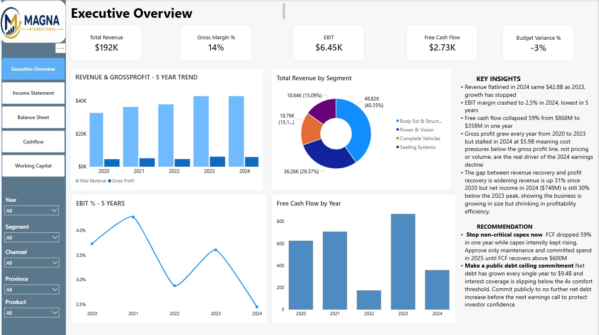
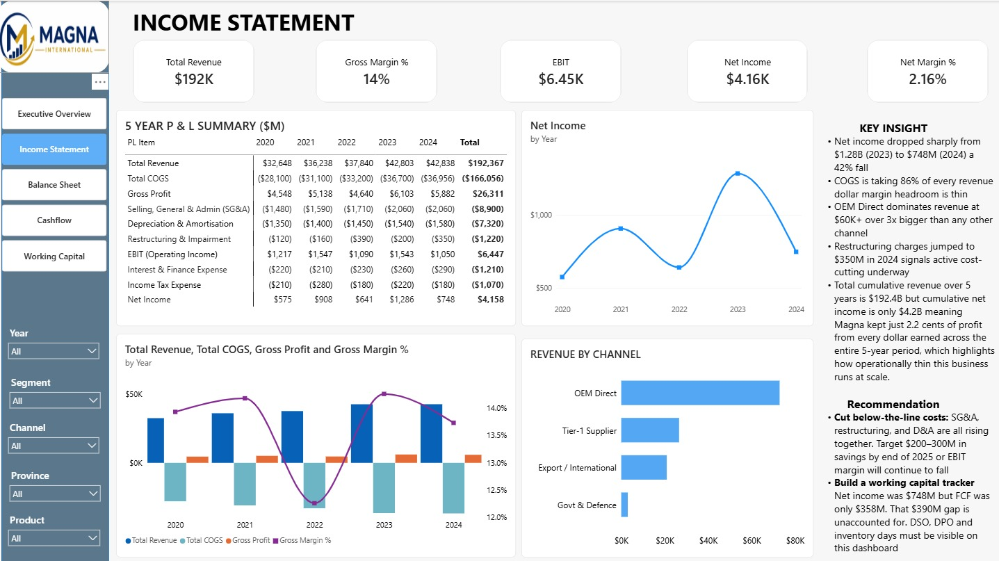
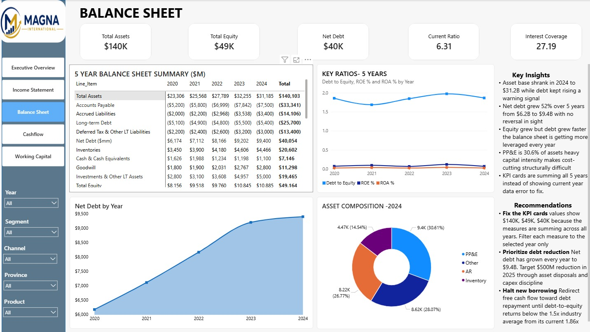
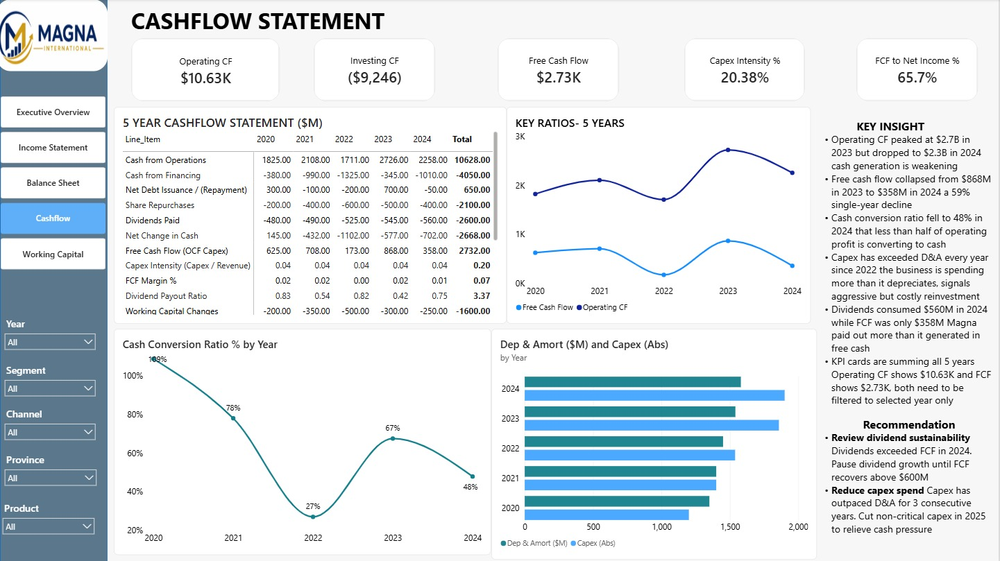
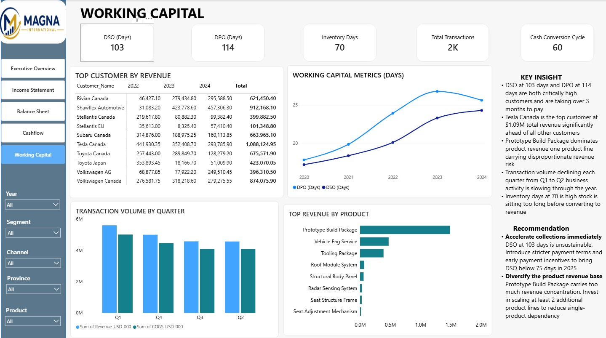

# 🚗 Magna International CFO Performance Dashboard

A Power BI financial analytics project analyzing five years of financial performance for a global automotive manufacturer, identifying profitability decline, working capital pressure, tariff exposure, and CFO recovery priorities.

---

## 📷 Dashboard Preview

---

## 📌 Project Overview

Magna International achieved strong revenue performance, but profitability declined due to rising costs, programme cancellations, EV investment deferrals, tariff exposure, pricing pressure, and worsening payment behavior.

This project delivers a **7-page CFO executive dashboard** designed to help leadership understand financial risk, identify root causes, and prioritize short-term recovery actions.

---

## 📊 Executive Summary

| KPI Area | Insight |
|---|---|
| Revenue | Record revenue performance, but weaker profitability |
| EBIT | Decline driven by structural cost and segment pressures |
| Working Capital | DSO expansion and overdue AR increased cash pressure |
| Capex | Investment levels exceeded earnings capacity |
| Customer Risk | Two customers represented nearly half of revenue |
| Tariff Risk | Geographic concentration increased exposure |

---

## 🎯 Business Problem

Leadership needed a unified financial dashboard to answer key questions:

- Why is profitability declining despite strong revenue?
- Which segments are contributing most to EBIT deterioration?
- Where is working capital pressure building?
- How much tariff exposure is affecting financial performance?
- Which customers create concentration risk?
- What actions should the CFO prioritize in the next 6–12 weeks?

---

## 🧩 Dashboard Pages

| Page | Dashboard Area | Focus |
|---|---|---|
| P1 | Executive Overview | KPIs, alerts, revenue and EBIT trends |
| P2 | Income Statement | Margin movement and cost structure |
| P3 | Segment & EBIT Bridge | Breakdown of EBIT decline |
| P4 | Working Capital | AR aging, DSO/DPO, overdue risk |
| P5 | Cash Flow & Capex | FCF bridge, capex vs EBIT |
| P6 | Geographic & Scenario Model | Tariff exposure and recovery scenarios |
| P7 | Customer Analytics | Revenue concentration and transaction drill-through |

---

## 🚨 Key Findings

### Profitability Decline

- EBIT decline was structural, not temporary
- Programme losses, EV deferrals, pricing pressure, tariffs, and payment delays contributed to weaker profitability
- Segment-level performance needed deeper review and restructuring

### Working Capital Pressure

- DSO expansion created delayed cash collection
- Overdue AR signaled growing cash flow risk
- Payment behavior required tighter collection and escalation workflows

### Capex and Free Cash Flow Risk

- Capex exceeded earnings capacity
- Investment intensity pressured free cash flow
- CFO decision-making required stronger capex discipline and prioritization

### Customer Concentration Risk

- Two customers accounted for nearly half of revenue
- Revenue dependency increased business risk
- Customer-level drill-through helped identify exposure and concentration patterns

### Tariff Exposure

- Geographic concentration amplified tariff-related financial risk
- Recovery scenarios helped model potential mitigation strategies

---

## 🔍 Root Cause Analysis

| Root Cause | Business Impact |
|---|---|
| Programme cancellations | Reduced profitability and weakened segment performance |
| EV investment deferrals | Delayed expected returns and margin improvement |
| Pricing pressure | Compressed margins despite revenue strength |
| Tariff exposure | Increased cost burden across exposed geographies |
| DSO expansion | Slowed cash conversion and pressured liquidity |
| High capex intensity | Reduced free cash flow flexibility |
| Customer concentration | Increased dependency on a small number of major customers |

---

## 💡 Strategic Recommendations

### 1. EBIT Recovery & Segment Restructuring

- Review or restructure underperforming segments
- Renegotiate EV programme terms
- Set minimum EBIT margin thresholds
- Implement targeted cost-efficiency initiatives

### 2. Working Capital & Cash Repair

- Reduce DSO through focused collections
- Lower overdue AR using escalation workflows
- Introduce early-payment incentives where financially beneficial
- Improve visibility into customer payment behavior

### 3. Capex Discipline & FCF Protection

- Reduce capex to align with earnings
- Prioritize high-return investment projects
- Strengthen tariff cost-recovery mechanisms
- Protect free cash flow through disciplined capital allocation

### 4. Geographic Diversification & Tariff Mitigation

- Expand revenue outside high-exposure regions
- Build local-for-local manufacturing capabilities
- Monitor tariff changes through a dedicated dashboard
- Model tariff recovery scenarios for leadership decisions

---

## 🎯 6–12 Week CFO Roadmap

| Timeline | Priority Actions |
|---|---|
| Weeks 1–2 | Validate KPIs, identify immediate risks, freeze non-essential spending, tighten cash controls |
| Weeks 3–5 | Conduct segment profitability and working-capital diagnostics, identify high-impact levers |
| Weeks 6–8 | Launch cost-reduction and cash-recovery initiatives, implement pricing and contract adjustments |
| Weeks 9–12 | Monitor KPI improvements weekly, refine strategy based on early results |

---

## 🏗️ Data Model

The project uses a finance-focused star schema designed for CFO-level reporting and scenario analysis.

| Model Layer | Description |
|---|---|
| Fact Tables | 2 fact tables supporting financial performance and transaction-level analysis |
| Dimension Tables | 5 dimensions supporting segment, customer, geography, time, and financial categories |
| Data Format | Excel long-format dataset |
| Model Type | Star Schema |
| Relationship Design | Structured model optimized for reporting, filtering, and KPI analysis |

---

## 🛠️ Tools & Technologies

| Layer | Tool |
|---|---|
| Visualization | Power BI Desktop |
| Calculations | DAX |
| Measures | 20 production measures |
| Data Preparation | Power Query |
| Data Source | Excel long-format dataset |
| Data Modeling | Star Schema |
| Analytics | EBIT bridge, margin analysis, working capital analysis, scenario modeling |

---

## 📈 Business Impact

This dashboard helped identify:

- Structural drivers behind EBIT decline
- Working capital deterioration and overdue AR risk
- Capex pressure against earnings performance
- Customer concentration exposure
- Tariff-related financial risk
- CFO recovery actions for the next 6–12 weeks

---

## 📷 Dashboard Screenshots

### Executive Overview

### Income Statement

### Balance Sheet Statement

### Cash Flow Statement

### Working Capital

---

## ✅ What This Project Demonstrates

- End-to-end Power BI dashboard development
- Financial statement analysis
- CFO-level KPI reporting
- DAX measure development
- Power Query transformation
- Star schema data modeling
- EBIT bridge analysis
- Working capital analysis
- Free cash flow and capex analysis
- Scenario modeling
- Executive-level data storytelling

---
